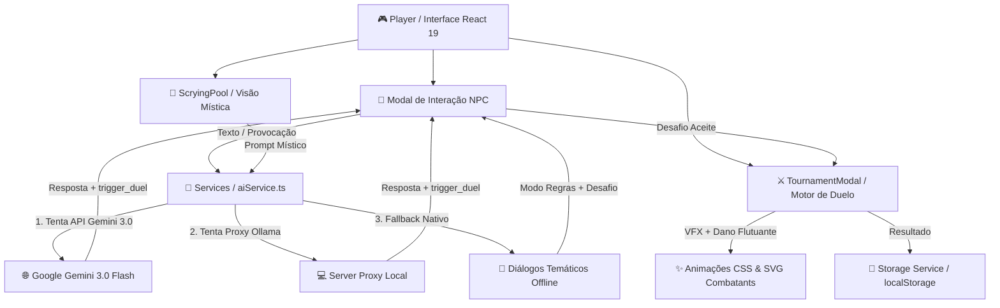

# 🐉 Dragonwood Academy (Academia Dragonwood)


> **Dragonwood Academy** é um RPG tático e narrativo em tempo real focado no treino de dragões elementais, exploração académica, diálogos orientados por Inteligência Artificial (Google Gemini 3.0) e combates em duelo 1v1 cheios de efeitos visuais (VFX)!

---

## 🌟 Principais Funcionalidades

- **🧠 Diálogos Dinâmicos com IA (Google Gemini 3.0):**
  Conversa com NPCs da academia (Elara, Bren, Seraphina, Kael) que possuem personalidades únicas, memória de conversa e reagem a provocações em português impecável.

- **⚔️ Sistema de Provocação por Texto & Duelos 1v1:**
  Provoca verbalmente os NPCs no chat (ex: *"és muito fraco"*, *"aposto que ganho fácil"*). Se forem desafiados ou insultados, os NPCs ficam furiosos, perdem afinidade e desafiam-te para um duelo de dragões instantâneo!

- **⚡ Combate Tático com Efeitos Visuais (VFX):**
  Motor de batalha baseado em turnos com:
  - Números de dano flutuantes em vermelho (`-10 HP`).
  - Animações de tremor de ecrã (`hit-shake`) e flashes de impacto.
  - Efeitos visuais de corte elemental em SVG.

- **🐉 Dragões Elementais & Brasões SVG Customizados:**
  Sete elementos distintos (*Fogo, Água, Terra, Ar, Raio, Luz, Sombra*) com ícones SVG dinâmicos, anéis mágicos e insígnias reluzentes.

- **🔮 Piscina de Adivinhação & Visões místicas:**
  Espreita os pensamentos e visões crípticas dos dragões ou rivais através de visões proféticas geradas pela IA.

- **🏛️ Exploração & Ranking da Academia:**
  Sobe no ranking da academia (#100 a #1), treina atributos (Força, Defesa, Agilidade, Meditação Elemental), equipa relíquias e avança o ciclo diário.

---

## 📊 Arquitetura do Sistema



---

## 🐉 Matriz de Elementos dos Dragões

| Elemento | Ícone | Cor Temática | Atributo Principal |
| :--- | :---: | :--- | :--- |
| **Fogo** 🔥 | `Flame` | Vermelho / Âmbar | **Ataque Devastador** |
| **Água** 🌊 | `Droplets` | Azul Oceano | **Mana & Regeneração** |
| **Terra** 🌿 | `Shield` | Verde Esmeralda | **Defesa Impenetrável** |
| **Ar** 💨 | `Wind` | Cobre / Vento | **Agilidade & Esquiva** |
| **Raio** ⚡ | `Zap` | Amarelo Relâmpago | **Velocidade Extrema** |
| **Luz** ☀️ | `Sun` | Dourado Solar | **Precisão Mágica** |
| **Sombra** 🌙 | `Moon` | Roxo Místico | **Ataque Sombrio** |

---

## 🚀 Como Executar o Projeto

### Pré-requisitos
- Node.js (v18+)
- npm ou bun

### 1. Clonar o Repositório
```bash
git clone https://github.com/sxnraku/DragonwoodAcademy.git
cd DragonwoodAcademy
```

### 2. Instalar Dependências
```bash
npm install --legacy-peer-deps
```

### 3. Executar o Servidor de Desenvolvimento (Vite)
```bash
npm run dev
```
Acede a **`http://localhost:5180/`** no teu navegador!

### 4. Executar em Modo Desktop (Electron)
```bash
npm run electron:dev
```

---

## ⚙️ Configuração da Chave de API da IA (Google Gemini)

O projeto inclui suporte para a API do **Google Gemini**. Para utilizar a tua própria chave:

1. Obtém a tua API Key gratuita no [Google AI Studio](https://aistudio.google.com/app/apikey).
2. Cria um ficheiro `.env` na raiz do projeto (podes copiar o `.env.example`).
3. Adiciona a tua chave de API no `.env`:
```env
VITE_GEMINI_API_KEY=sua_chave_api_aqui
```

---

## 🎮 Como Jogar

1. **Criação de Domador:** Escolhe o teu nome, nome do dragão e o seu elemento inicial.
2. **Exploração:** Visita a Biblioteca, Arena, Floresta ou Salão Principal.
3. **Conversar & Provocar:** Fala com NPCs como a *Elara Swiftwood*. Tenta conversar amigavelmente ou provocá-la com provocações como *"és fraca"* ou *"aposto que ganho fácil"*.
4. **Duelo 1v1:** Aceita o desafio quando o NPC ficar indignado para entrar diretamente em combate com VFX!
5. **Evolução:** Treina o teu dragão, ganha moedas de ouro e sobe até ao topo do ranking da academia!

---

## 📜 Licença

Distribuído sob a licença **MIT**. Consulta `LICENSE` para mais detalhes.

---
*Criado com paixão por **sxnraku** para a Dragonwood Academy.* 🐉⚔️
