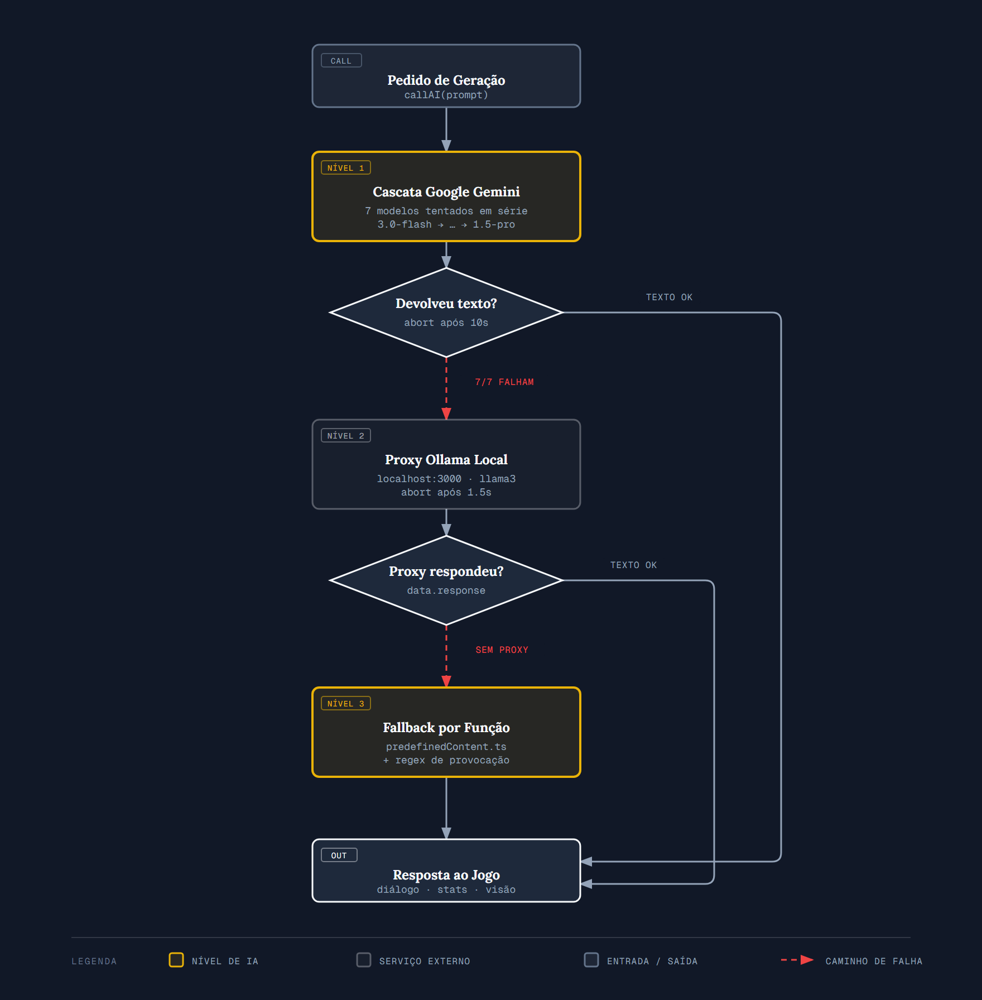
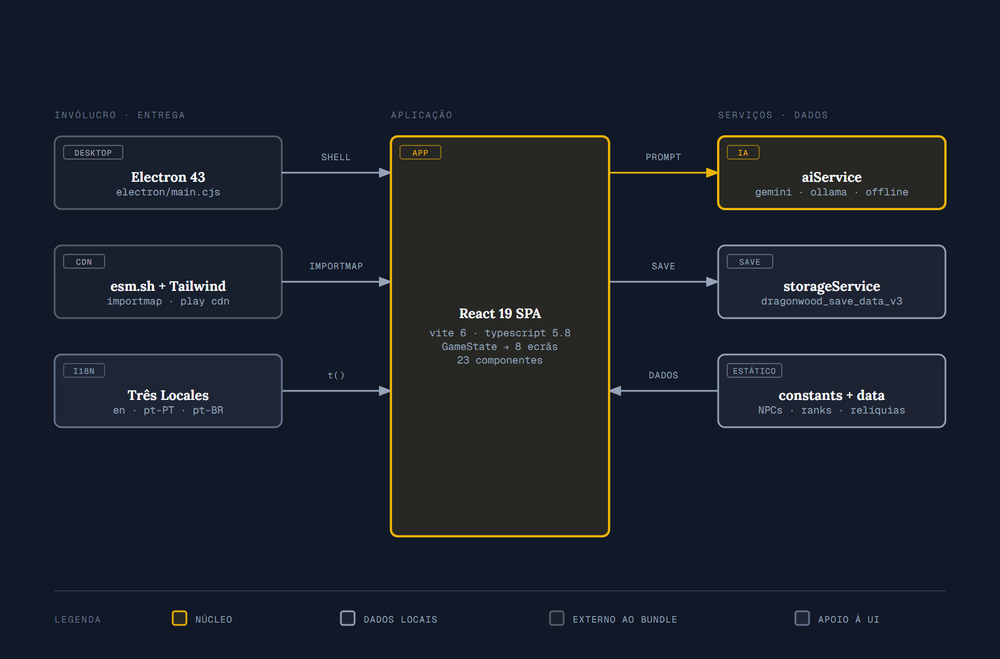
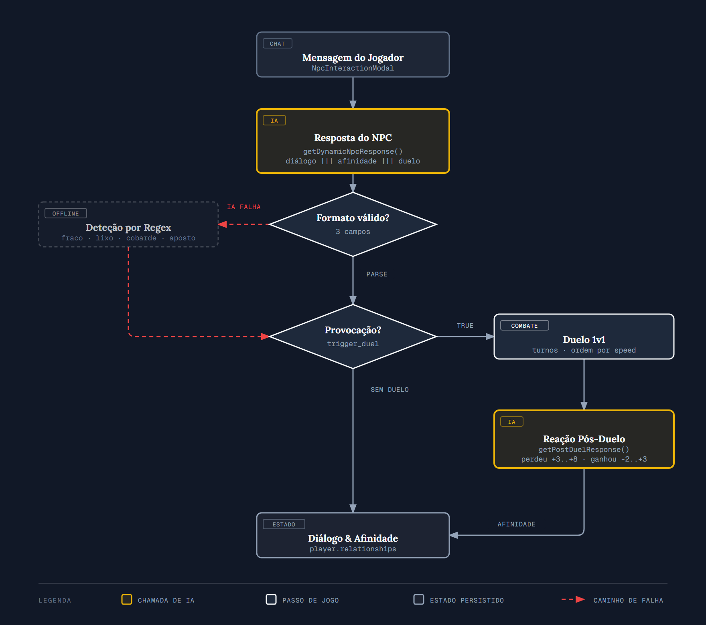

# 🐉 Dragonwood Academy (Academia Dragonwood)


> **Dragonwood Academy** é um RPG tático e narrativo em tempo real focado no treino de dragões elementais, exploração académica, diálogos orientados por Inteligência Artificial e combates em duelo 1v1 cheios de efeitos visuais (VFX)!

---

## 🌟 Principais Funcionalidades

- **🧠 Diálogos Dinâmicos com IA:**
  Conversa com NPCs da academia (Elara, Bren, Seraphina, Kael) que possuem personalidades únicas, memória das últimas 6 mensagens e reagem a provocações em português impecável.

- **⚔️ Sistema de Provocação por Texto & Duelos 1v1:**
  Provoca verbalmente os NPCs no chat (ex: *"és muito fraco"*, *"aposto que ganho fácil"*). Se forem desafiados ou insultados, os NPCs ficam furiosos, perdem afinidade e desafiam-te para um duelo de dragões instantâneo!

- **🗣️ Diálogo Pós-Batalha:**
  Quando o duelo nasce de uma provocação, o NPC volta a falar no fim do combate para reagir ao resultado. Se perdeu, a raiva dá lugar a respeito e a afinidade sobe; se ganhou, fica arrogante. A reação é gerada em character, não é texto fixo.

- **⚡ Combate Tático com Efeitos Visuais (VFX):**
  Motor de batalha baseado em turnos, com a ordem de ataque decidida pela estatística de `speed`:
  - Números de dano flutuantes em vermelho (`-10 HP`).
  - Animações de tremor de ecrã (`hit-shake`) e flashes de impacto.
  - Efeitos visuais de corte elemental em SVG.

- **🐉 Dragões Elementais & Brasões SVG Customizados:**
  Sete elementos distintos (*Fogo, Água, Terra, Ar, Raio, Luz, Sombra*) com ícones SVG dinâmicos, anéis mágicos e insígnias reluzentes.

- **🔮 Piscina de Adivinhação & Visões místicas:**
  Espreita os pensamentos e visões crípticas dos dragões ou rivais através de visões proféticas geradas pela IA.

- **🏛️ Exploração & Ranking da Academia:**
  Sobe no ranking da academia (#100 a #1), treina atributos (Força, Defesa, Agilidade, Meditação Elemental), equipa relíquias e avança o ciclo diário.

- **🌍 Três idiomas & Desktop:**
  Português (PT), Português (BR) e Inglês. Corre no browser ou como aplicação nativa via Electron.

---

## 📊 Diagramas de Arquitetura & Fluxos

> Renderizados a partir de ficheiros HTML self-contained (SVG inline, sem build e sem JavaScript) em [`docs/diagrams/`](docs/diagrams/). Abre qualquer um no browser para a versão completa.

### 1. 🧠 Cascata de Resiliência da IA



Toda a geração de texto passa por `callAI()`, que degrada em três níveis até nunca deixar o jogo sem resposta.

O **nível 1** não é uma chamada única: percorre uma lista de modelos Gemini em série e fica pelo primeiro que devolver texto. Os modelos `2.5`, `2.0` e `1.5` foram retirados desta lista porque devolvem `404 — no longer available to new users` em chaves criadas recentemente; os aliases `-latest` são preferidos por acompanharem a versão atual sem apodrecer.

O **nível 3** é específico de cada função — a Piscina de Adivinhação devolve uma frase de águas turvas, a criação de dragão sorteia stats e descrição de `predefinedContent.ts`, e o diálogo de NPC passa por um regex de provocação que mantém os duelos a funcionar mesmo totalmente offline.

<sub>📄 [`01-cascata-ia.html`](docs/diagrams/01-cascata-ia.html) &nbsp;·&nbsp; 💻 [`services/aiService.ts`](services/aiService.ts), [`data/predefinedContent.ts`](data/predefinedContent.ts)</sub>

---

### 2. 🏛️ Arquitetura Geral do Sistema



Aplicação inteiramente cliente: não há servidor de jogo nem base de dados remota. Todo o estado (jogador, dragão, histórico, roster da academia) vive numa única chave de `localStorage`, e o Electron limita-se a embrulhar a mesma SPA que corre no browser.

Note-se que o React, o `@google/genai` e o `lucide-react` são carregados de **esm.sh** por importmap, e o Tailwind vem do **Play CDN** — nenhum deles é compilado no bundle. Isso torna o arranque trivial, mas significa que a aplicação precisa de rede mesmo para o que não é IA.

<sub>📄 [`02-arquitetura-sistema.html`](docs/diagrams/02-arquitetura-sistema.html) &nbsp;·&nbsp; 💻 [`App.tsx`](App.tsx), [`components/GameView.tsx`](components/GameView.tsx), [`storageService.ts`](storageService.ts)</sub>

---

### 3. ⚔️ Da Provocação ao Duelo, e de Volta



O ciclo que dá identidade ao jogo. A deteção de provocação existe deliberadamente em **dois** sítios: dentro do prompt enviado ao modelo, e num regex local que corre quando a IA falha. Assim o desafio dispara mesmo sem rede.

O resultado do combate volta a entrar na conversa através de `getPostDuelResponse()`, com o intervalo de afinidade limitado no código para o modelo não exagerar na recompensa.

<sub>📄 [`03-provocacao-duelo.html`](docs/diagrams/03-provocacao-duelo.html) &nbsp;·&nbsp; 💻 [`components/NpcInteractionModal.tsx`](components/NpcInteractionModal.tsx), [`components/TournamentModal.tsx`](components/TournamentModal.tsx)</sub>

---

## 🐉 Matriz de Elementos dos Dragões

| Elemento | Ícone | Cor Temática |
| :--- | :---: | :--- |
| **Fogo** 🔥 | `Flame` | Vermelho / Âmbar |
| **Água** 🌊 | `Droplets` | Azul Oceano |
| **Terra** 🌿 | `Shield` | Verde Esmeralda |
| **Ar** 💨 | `Wind` | Cobre / Vento |
| **Raio** ⚡ | `Zap` | Amarelo Relâmpago |
| **Luz** ☀️ | `Sun` | Dourado Solar |
| **Sombra** 🌙 | `Moon` | Roxo Místico |

> **Nota:** os elementos são hoje identidade visual e narrativa. A fórmula de dano do duelo é `max(1, attack + poder_da_habilidade − defesa/2)` e **não** aplica multiplicadores elementais — não existe vantagem de Fogo sobre Terra, por exemplo.

---

## 🚀 Como Executar o Projeto

### Pré-requisitos
- Node.js (v18+)
- npm ou bun

### 1. Clonar o Repositório
```bash
git clone https://github.com/sxnraku/DragonwoodAcademy.git
cd DragonwoodAcademy
```

### 2. Instalar Dependências
```bash
npm install --legacy-peer-deps
```

### 3. Executar o Servidor de Desenvolvimento (Vite)
```bash
npm run dev
```
Acede a **`http://localhost:3000/`** no teu navegador.

### 4. Executar em Modo Desktop (Electron)
```bash
npm run electron:dev
```

---

## ⚙️ Configuração da Chave de API da IA

### Nível 1 — Google Gemini (recomendado)

1. Obtém a tua API Key gratuita no [Google AI Studio](https://aistudio.google.com/app/apikey).
2. Cria um ficheiro `.env` na raiz do projeto (podes copiar o `.env.example`).
3. Adiciona a tua chave:

```env
VITE_GEMINI_API_KEY=a_tua_chave_aqui
```

4. Reinicia o servidor — o Vite só lê o `.env` no arranque.

> Se a consola do browser mostrar `403 ... reported as leaked`, a Google revogou a chave por ter sido exposta publicamente. Não há como reativá-la: gera uma nova e apaga a antiga.

### Nível 2 — Proxy local (opcional)

Se tiveres [Ollama](https://ollama.com) a correr, o jogo usa-o automaticamente quando o Gemini falha. Para apontar para outro endpoint:

```env
VITE_AI_PROXY_URL=http://localhost:11434/api/generate
VITE_OLLAMA_MODEL=llama3
```

> **Não uses a porta 3000** — é a mesma do dev server do Vite, e o pedido acabaria a bater no próprio servidor.

O jogo funciona sem qualquer configuração de IA: sem chave e sem proxy, cai no nível 3 e usa os diálogos offline.

---

## 🎮 Como Jogar

1. **Criação de Domador:** Escolhe o teu nome, nome do dragão e o seu elemento inicial.
2. **Exploração:** Visita a Biblioteca, Arena, Floresta ou Salão Principal.
3. **Conversar & Provocar:** Fala com NPCs como a *Elara Swiftwood*. Tenta conversar amigavelmente ou provocá-la com *"és fraca"* ou *"aposto que ganho fácil"*.
4. **Duelo 1v1:** Aceita o desafio quando o NPC ficar indignado para entrar diretamente em combate com VFX!
5. **Encerramento:** No fim do duelo o NPC reage ao resultado e a afinidade ajusta-se.
6. **Evolução:** Treina o teu dragão, ganha moedas de ouro e sobe até ao topo do ranking da academia!

---

## 📜 Licença

Distribuído sob a licença **MIT**. Consulta `LICENSE` para mais detalhes.

---
*Criado com paixão por **sxnraku** para a Dragonwood Academy.* 🐉⚔️
